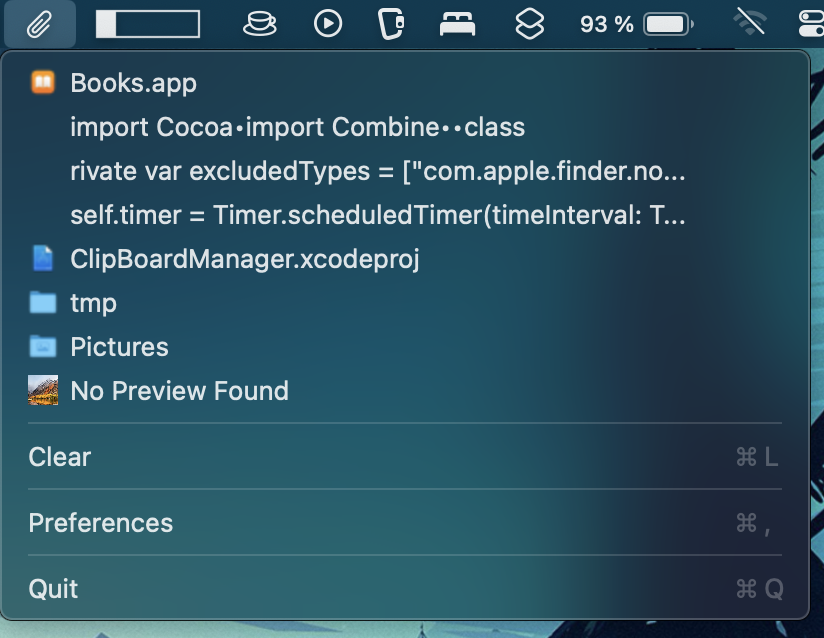

# ClipBoardManager
A macOS menubar clipboard manager with file support.

## Features
The menu bar item menu shows the clipboard history. The app tries to reconstruct the clipboard state as closely as possible. Therefore, the app supports a wide variety of formats, e.g.

- Files
- Multiple files
- Directories
- Web images
- Text

Files have a little icon representing the file type, and web images have a little preview icon.

## Requirements and Versions
The standard version makes use of APIs that are only available on **MacOS13** and later. An older version for earlier versions of MacOS is included in the **MacOS12 Directory**. The older version has fewer features, e.g. no start at login via app preferences.

